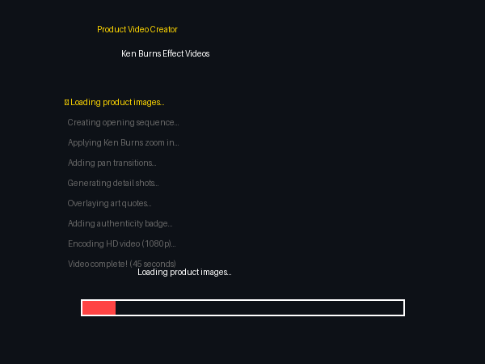

# Product Video Creator


**Create stunning Ken Burns style videos from product photos - perfect for eBay, social media, and galleries.**



---

## What Does This Do?

Turn static product images into professional videos:

1. **Loads your product crops** (main image + detail shots)
2. **Applies Ken Burns effect** - smooth pan and zoom
3. **Adds elegant transitions** between shots
4. **Overlays text** - quotes, authenticity badges
5. **Exports HD video** ready for upload

**Input:** 8 product photos
**Output:** 45-second professional video

---

## Quick Start

```bash
# Clone the repo
git clone https://github.com/jjshay/product-video-creator.git
cd product-video-creator

# Install dependencies
pip install -r requirements.txt

# Run the interactive demo
python demo.py

# Or run the visual showcase
python showcase.py

# Create video from sample artwork crops
python create_product_videos.py examples/ --output output/
```

### Sample Files
- `examples/artwork_full.jpg` - Full artwork image
- `examples/artwork_top_left.jpg` - Detail crop (top left corner)
- `examples/artwork_signature.jpg` - Signature detail crop
- `examples/video_config.json` - Video configuration
- `sample_output/video_spec.json` - Example video specification

---

## Ken Burns Effect

The Ken Burns effect creates motion from still images:

```
Frame 1: Zoom into artwork (3 seconds)
    ↓ crossfade
Frame 2: Pan across detail (3 seconds)
    ↓ crossfade
Frame 3: Zoom out from signature (3 seconds)
    ↓ crossfade
Frame 4: Full artwork reveal (4 seconds)
```

This creates engaging videos that hold viewer attention much better than static images.

---

## Video Structure (45 seconds)

| Segment | Duration | Content |
|---------|----------|---------|
| Opening | 5s | Full artwork with zoom in |
| Detail 1 | 4s | Top left corner pan |
| Detail 2 | 4s | Top right corner pan |
| Detail 3 | 4s | Center texture zoom |
| Detail 4 | 4s | Signature closeup |
| Quote | 3s | Inspirational art quote |
| Detail 5 | 4s | Bottom detail pan |
| Full Art | 5s | Complete artwork zoom out |
| Authenticity | 4s | COA badge overlay |
| Closing | 8s | Logo + call to action |

---

## Features

- **HD Output**: 1920x1080 at 30fps
- **Smooth Motion**: Natural pan/zoom with easing
- **Text Overlays**: Art quotes, authenticity badges
- **Color Matching**: Background matches artwork palette
- **Batch Processing**: Generate videos for entire inventory
- **Google Drive Upload**: Automatic upload to specified folder

---

## Art Quotes Library

The system includes inspiring quotes:
- "Own a piece of history"
- "Invest in timeless art"
- "Museum-quality artwork"
- "Certified authentic"
- And 15+ more...

---

## Setup

### Basic
```bash
pip install -r requirements.txt
python demo.py
```

### Full Version (with Drive upload)
```bash
# Configure .env
cp .env.example .env
nano .env

# Add Google Drive folder ID
GOOGLE_DRIVE_FOLDER_ID=your_folder_id
```

---

## Files

| File | Purpose |
|------|---------|
| `create_product_videos.py` | Main video generator |
| `video_generator.py` | Core video creation functions |
| `batch_video_generator.py` | Process multiple products |
| `demo.py` | Demo without dependencies |

---

## Requirements

- Python 3.8+
- FFmpeg (for video encoding)
- OpenCV (image processing)

---

## License

MIT - Create amazing product videos!
