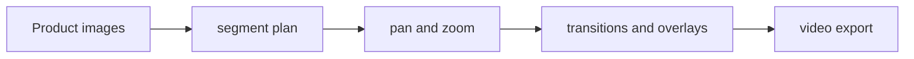

# Product Photo Video Creator — Project Brief

## At a glance

| Field | Value |
|---|---|
| Portfolio area | Creative tooling |
| Repository | [jjshay/product-video-creator](https://github.com/jjshay/product-video-creator) |
| Status | Source available; runtime not revalidated in this documentation review |
| Evidence review | 2026-09-11; [commit 2df932b](https://github.com/jjshay/product-video-creator/tree/2df932b96112643fc5f21cff29d298093985f423) |

## Problem and intended value

Still product images need a lightweight way to become motion content.

The intended value is a repeatable workflow whose inputs, transformations, and outputs can be inspected. Use the evidence below to distinguish implementation from business outcomes.

## Architecture and data flow

Product images → segment plan → pan and zoom → transitions and overlays → video export.

## Implementation evidence

| Source | Reading purpose |
|---|---|
| [create_product_videos.py](../create_product_videos.py) | Implementation component supporting the data flow described above. |
| [video_generator.py](../video_generator.py) | Implementation component supporting the data flow described above. |
| [tests/test_video.py](../tests/test_video.py) | Behavioral test source; inspect fixtures and assertions before interpreting coverage. |

The links above point to the current repository. The review reference identifies the version used to prepare this brief.

## Setup and operation

Use the existing [README](../README.md) for setup and operating commands. Configuration and dependency references: [requirements.txt](../requirements.txt), [pyproject.toml](../pyproject.toml), [.env.example](../.env.example).

Start with sample or fixture inputs. Where external services are involved, configure a test account and check the distinction between a local preview, a generated artifact, and a remote write. Credentials and operational datasets are environment-specific.

## Validation and outcomes

**Review result:** Repository tree and referenced source reviewed. Existing application tests, hosted deployments, paid providers, and external mutations were not re-run in this documentation review.

Test sources found: [tests/test_video.py](../tests/test_video.py). Their presence does not mean the suite was run in this review.

The source implements the workflow described above. No new revenue, accuracy, conversion, or production-uptime result is asserted by this documentation update.

Documentation itself is checked by `python3 scripts/check_project_docs.py`; that check validates this structure and its source references, not application behavior.

## Decisions and limitations

A deterministic photo-to-video pipeline is economical but needs careful framing and duration checks.

Keep provider-dependent observations dated and separate from deterministic transformations. State which assumptions a demonstration uses and which integrations it actually exercises.

## Interview talking points

- **Problem and product judgment:** Explain why this workflow mattered to its intended operator: Still product images need a lightweight way to become motion content.
- **Technical walkthrough:** Trace one concrete input through this sequence: Product images → segment plan → pan and zoom → transitions and overlays → video export.
- **Engineering tradeoff:** A deterministic photo-to-video pipeline is economical but needs careful framing and duration checks.
- **Evidence and ownership:** Open the source links above, identify the specific design or implementation decisions you personally drove, and distinguish AI-assisted implementation from measured operating results.
- **What comes next:** Render a known fixture and verify duration, resolution, crop safety, and overlay readability.

## Next improvements

Render a known fixture and verify duration, resolution, crop safety, and overlay readability.

Record any follow-up result with a date, exact command or evaluation method, input scope, observed output, and limitations. Update `project.json` alongside this brief.

## Related projects

- [Art Print Manager](https://github.com/jjshay/ArtPrint) — Creative tooling.
- [AirDrop Photo Pipeline](https://github.com/jjshay/airdrop-processor) — Creative tooling.
- [Art Crop System](https://github.com/jjshay/art-crop-system) — Creative tooling.
- [Art Video Overlay](https://github.com/jjshay/art-video-project) — Creative tooling.
- [Handwriting Analysis Prototype](https://github.com/jjshay/handwriting-analysis) — Creative tooling.

Some related repositories require authorized GitHub access.
